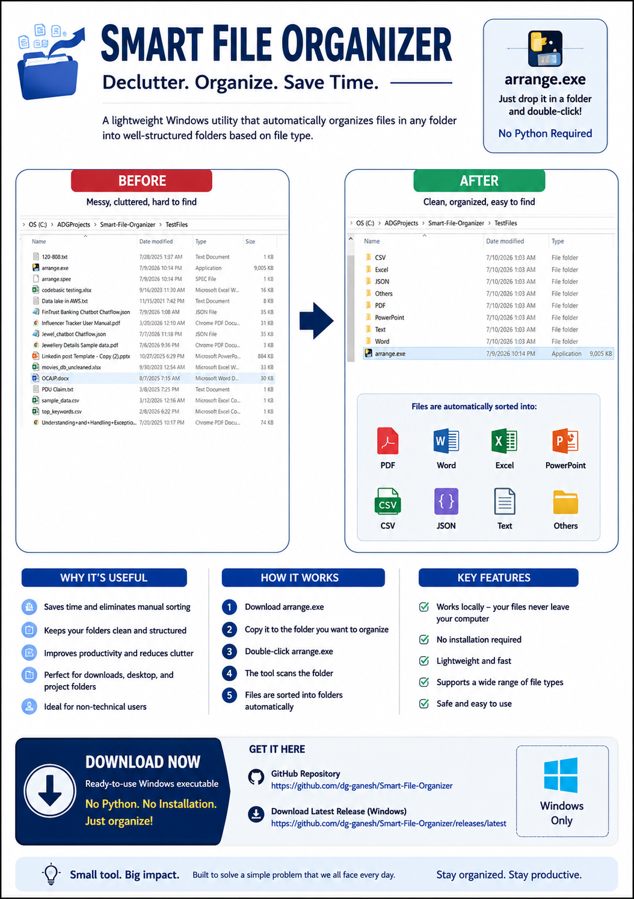

# Smart File Organizer

A lightweight Windows utility that automatically organizes files into folders based on file type.



---

## What is Smart File Organizer?

Smart File Organizer is a simple desktop utility built to solve a common problem—folders that become cluttered with dozens or hundreds of different file types.

Simply copy **arrange.exe** into any folder, double-click it, and your files are automatically organized into folders such as:

- PDF
- Word
- Excel
- PowerPoint
- CSV
- JSON
- Text
- Others

No installation or Python knowledge is required.

---

## Features

- Organizes files automatically
- Works on any Windows folder
- No installation required
- No Python required
- Lightweight executable
- Safe (works locally on your computer)
- Fast and easy to use

---

## Example

The poster above demonstrates the transformation from a cluttered folder to a neatly organized folder after running the utility.

---

## Download

Download the latest Windows executable from the Releases page:

https://github.com/dg-ganesh/smart-file-organizer/releases/latest

---

## Repository Structure

```
Smart-File-Organizer/
│
├── arrange.py
├── reverse_arrange.py
├── requirements.txt
├── README.md
├── LICENSE
├── .gitignore
├── screenshots/
│   └── poster.png
└── TestFiles/
```

---

## Technologies Used

- Python 3
- PyInstaller

---

## Future Enhancements

Planned improvements include:

- Recursive folder organization
- Custom folder mappings
- Drag-and-drop interface
- Duplicate file detection
- Undo history
- ZIP file handling
- Google Drive support
- Amazon S3 support
- OneDrive support

---

## License

MIT License